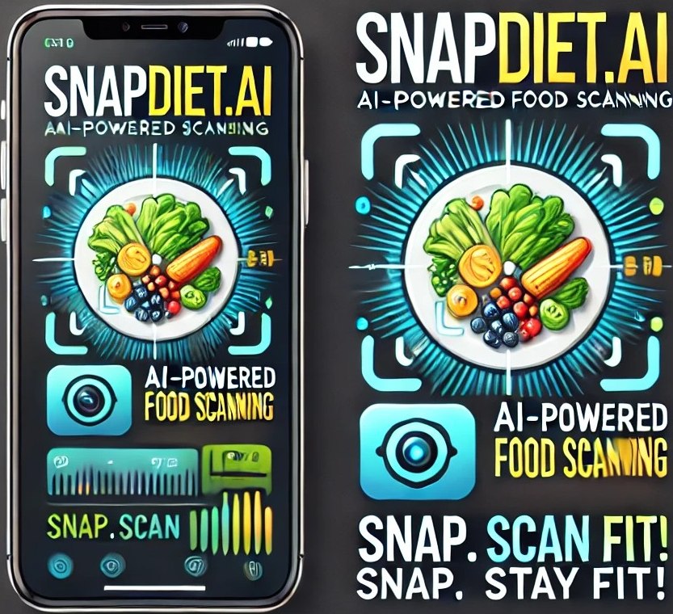
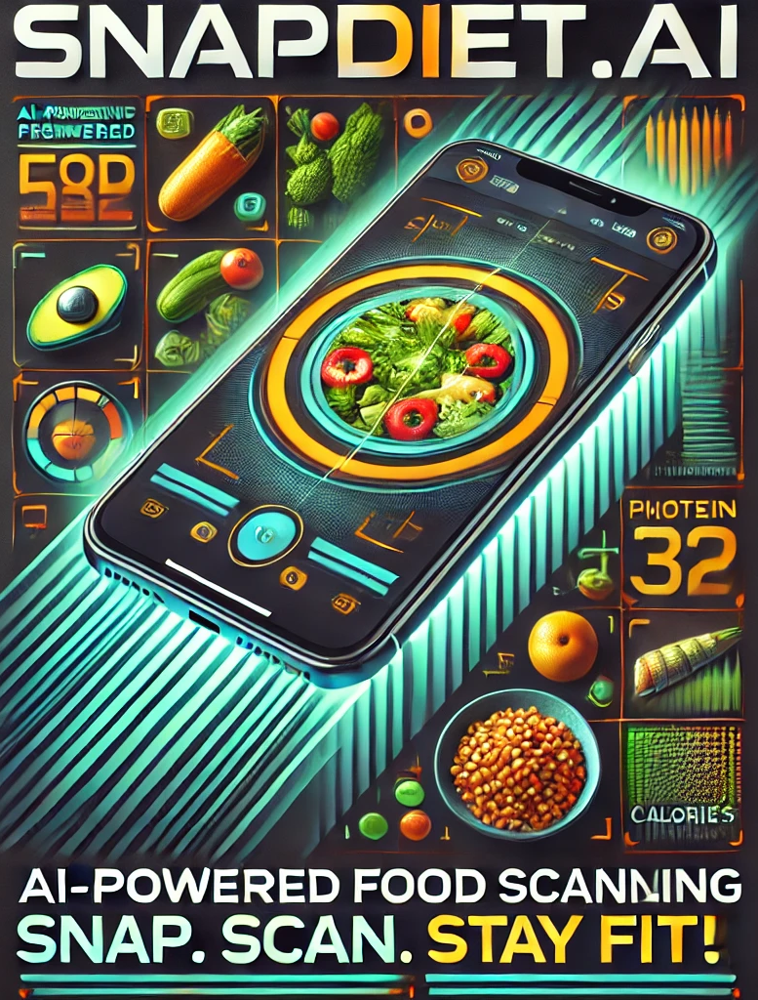

<p align="center">
  
  
  
  <a href="https://twitter.com/intent/follow?screen_name=abhishek_kumar">
    
  </a>
</p>

<div align="center">
<hr>
  <h1 align="center">✦ Introducing to 🤖SnapDiet.AI – AI-Powered Food Scanning✦</h1>
  
  <br><strong>
✦🤖 Welcome to SnapDiet.AI – Your AI-Powered Health & Nutrition Assistant! ✦</strong><br><br>
	<a href="https://snapdiet-ai.streamlit.app/">🌍👨‍💻🚨 **Live Demo APP & Try It Yourself!**</a><strong><br><br>

  
  `## 🔥 **Project Overview**  
🌱 Eat Smart. Stay Fit. Live Healthy.
SnapDiet.AI is your ultimate AI-powered health companion, designed to track nutrition, fitness, and mental well-being effortlessly. Whether you want to analyze your meals, plan workouts, or monitor your health progress, SnapDiet.AI does it all!

    Snap. Scan. Stay Fit! 😋


#🤖 SnapDiet.AI – AI-Powered Food Scanning
Snap. Scan. Stay Fit! 😋
  <br>

---

## 🎯 **Key App Features – Everything You Need in One Place! **  

### **🥗 Nutrition & Diet Management**  
**🍽️ AI Food Scanner** – Upload your meal photo and get instant nutritional insights.  
**📊 Calorie Breakdown** – Know what you're eating and its impact on your health.  
**🥗 Smart Meal Planner** – AI-curated meal plans based on your health goals.  
**🍏 Intermittent Fasting Tracker** – Track your fasting periods effortlessly.  
**👨‍⚕️ Virtual Dietitian Chatbot** – Your AI nutritionist, available 24/7.  

### **🏋️‍♂️ Fitness & Activity Tracking**  
**🚶‍♂️ Daily Step Tracker** – Track your daily steps and set fitness goals.  
**😴 Sleep Tracker** – Monitor and improve your sleep quality.  
**💧 Water Intake Tracker** – Stay hydrated with personalized reminders.  
**💪 Custom Workout Plans** – AI-generated fitness routines based on your body type and goals.  

### **🧘‍♂️ Mental Wellness & Lifestyle**  
**😊 Mood Tracker** – Log your daily emotions and mood trends.  
**🙏 Gratitude Journal** – Develop a positive mindset with daily gratitude logs.  
**🧘‍♂️ Mindfulness Exercises** – AI-powered guided meditation & breathing techniques.  
**🧠 Mental Health Check-In** – AI-assisted self-assessment for emotional well-being.  

### **📊 AI-Powered Health Reports & Tracking**  
**📜 Meal & Fitness History** – Keep track of your past meals, workouts, and health stats.  
**📈 Weekly Progress Report** – Measure and analyze your fitness journey.  
**📊 AI-Generated Monthly Health Report** – Get personalized insights on your overall health.  
---


---

## 🚀 **Why Choose SnapDiet.AI?**  

✅ **AI-Powered Food Scanner** – Upload a photo, and let AI analyze your meal instantly! 📸  
✅ **Smart Health Insights** – Get detailed calorie breakdowns, nutrient analysis, and recommendations. 📊  
✅ **Personalized Wellness Plan** – Tailored meal and workout plans just for you! 🏋️‍♂️  
✅ **Interactive & Easy-to-Use UI** – A beautifully designed, intuitive interface for a seamless experience. 🎨  
✅ **AI-Driven Reports & Tracking** – Monthly health reports, intermittent fasting tracker, and more! 📝  

---

---
## 🛠 **Tech Stack – Built with Cutting-Edge Technology!**  

| **Component**       | **Technology Used** |
|--------------------|-------------------|
| **Frontend**       | Streamlit (Python-based UI) |
| **Backend**        | Python |
| **AI Integration** | Google Gemini Pro Vision API |
| **Data Processing** | NumPy, Pandas |
| **Image Processing** | OpenCV, PIL |

---

Let me know if you need any modifications! 🚀

---
## 🗳 **Voting System – Have a Say!**  
💡 Love this project? Support us by **starring ⭐ this repo & voting for new features!**  

✔️ **Want a feature? Vote on GitHub Issues!**  
✔️ **Have ideas? Contribute & suggest improvements!**  

🌟 **[Give us a Star ⭐ on GitHub]https://github.com/abhishekkumar62000/SnapDiet.AI-AI-Powered-Food-Scanning**  

---

## 🤝 **Open Contribution – Join Our Team!**  
🚀 **💰AI Personal Finance Agent🤖 App is Open Source!**  

🔹 **Fork this repo** & contribute new features  
🔹 **Report bugs & suggest improvements** in Issues  
🔹 **Join our team & collaborate!**  

---

## 🎨 **UI/UX Animations & Features**  
🎬 **Live Animations & Interactive UI/UX**  
- Modern **AI-powered UI with real-time feedback animations**   

🔹 **Check out the AI-powered interactive experience!**  
## 🌍👨‍💻🚨 **Live Demo APP & Try It Yourself!**
:--https://snapdiet-ai.streamlit.app/

---

## 🚀 **Installation Guide**  

### 🔧 **Prerequisites**  
Make sure you have the following installed:  
- ✅ Python 3.8+ 🐍  
- ✅ pip 📦  
- ✅ Streamlit 🌐  
- ✅ Google Gemini API key (for AI-powered features) 🔑  

## 🔥 **How to Run This Project Locally?**  

### **1️⃣ Clone This Repo**
```bash
git clone https://github.com/abhishekkumar62000/SnapDiet.AI-AI-Powered-Food-Scanning.git
cd ai-🤖 SnapDiet.AI – AI-Powered Food Scanning Snap. Scan. Stay Fit! 😋
<p align="center">
  
</p>

---
   ```
2. **Install dependencies:**
   ```bash
   pip install -r requirements.txt
   ```
3. **Run the app:**
   ```bash
   streamlit run app.py
   ```

---


## ❤️ **Made with Passion by Abhishek Yadav & Open-Source Contributors!** 🚀✨


<h1 align="center">© LICENSE </h1>

<table align="center">
  <tr>
     <td>
       <p align="center"> </img>
    </td>
    <td> 
       <br> 
This project is licensed under <a href="./LICENSE">MIT</a>. 
    </td>
  </tr>
</table>


 <hr>

<div align="center">
<a href="#"></a>
	
### **Thanks for checking out my GitHub Profile!**  

 ## 💌 Sponser

  [](https://www.buymeacoffee.com/abhishekkumar62000)

## 👨‍💻 Developer Information
**Created by **Abhishek kumar** 
**📧 Email**: [abhiydv23096@gmail.com](mailto:abhiydv23096@gmail.com)  
**🔗 LinkedIn**: [Abhishek Kumar](https://www.linkedin.com/in/abhishek-kumar-70a69829a/)  
**🐙 GitHub Profile**: [@abhishekkumar62000](https://github.com/abhishekkumar62000)  
**📸 Developer Profile Image**:- 


</div>  


`Don't forget to give A star to this repository ⭐`


`👍🏻 All Set! 💌`

</div>

